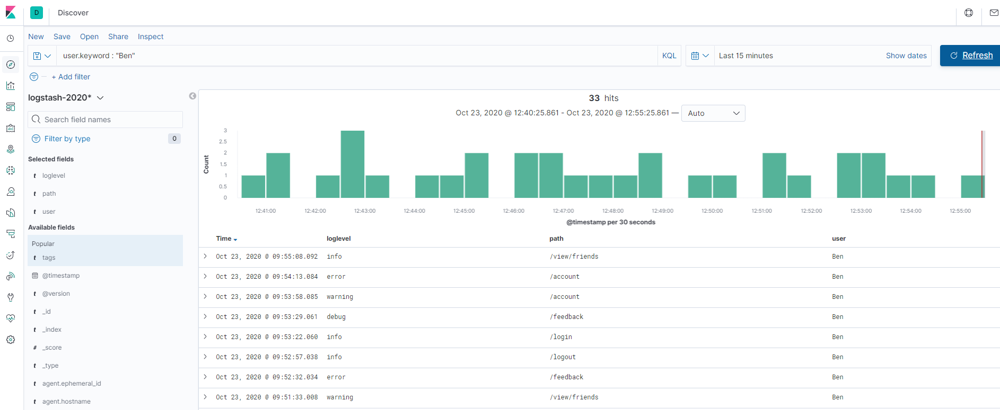

# Log Aggregation
The following article will describe a centralized logging solution for non-containerized apps running on bare-metal or cloud infrastructure using [ELK Stack](https://www.elastic.co/what-is/elk-stack) in AWS.

## What is ELK stack?

The ELK stack is an acronym used to describe a stack that comprises of three popular open-source projects: Elasticsearch, Logstash, and Kibana. Often referred to as Elasticsearch, the ELK stack gives you the ability to aggregate logs from all your systems and applications, analyze these logs, and create visualizations for application and infrastructure monitoring, faster troubleshooting, security analytics, and more.

**Elasticsearch** is an open-source, RESTful, distributed search and analytics engine built on Apache Lucene. Support for various languages, high performance, and schema-free JSON documents makes Elasticsearch an ideal choice for various log analytics and search use cases. 

**Logstash** is an open-source data ingestion tool that allows you to collect data from a variety of sources, transform it, and send it to your desired destination. With pre-built filters and support for over 200 plugins, Logstash allows users to easily ingest data regardless of the data source or type.

**Kibana** is an open-source data visualization and exploration tool for reviewing logs and events. Kibana offers easy-to-use, interactive charts, pre-built aggregations and filters, and geospatial support and making it the preferred choice for visualizing data stored in Elasticsearch.

## Installation
### Elasticsearch and Kibana
In order to avoid additional overhead in configuring and managing Elasticsearch and Kibana services, we will use [Amazon Elasticsearch Service](https://aws.amazon.com/elasticsearch-service/features/?nc=sn&loc=2).
### Logstash
Logstash will be installed on EC2 instance, more information about how to install can be found in [the following guide](https://aws.amazon.com/elasticsearch-service/resources/articles/logstash-tutorial/)
### Filebeat 
[Filebeat](https://www.elastic.co/guide/en/beats/filebeat/current/filebeat-overview.html) is a lightweight shipper for forwarding and centralizing log data. Installed as an agent on your servers, Filebeat monitors the log files or locations that you specify, collects log events, and forwards them either to Elasticsearch or Logstash for indexing.

**Filebeat** will be installed on the machines where our non-containerized apps are running. The following filebeat configuration will watch all the log files from `/var/log/app` directory and forward them to `logstash.url`
```
filebeat.inputs:
- type: log
  enabled: true
  paths:
    - "/var/log/app/*.log"

output.logstash:
  hosts: ["logstash.url:5044"]
```


## Costs
The costs will calculated with **1 Year All Upfront** [AWS Savings Plan](https://aws.amazon.com/savingsplans/) as savings plans is a flexible pricing model that provides savings of up to 72% on your AWS compute usage.

Region: **US East (N. Virginia)**

**Compute Services**
| Service               | Type                   | vCPU | Memory(GiB) | 1Y All Upfront | Per month |
|-----------------------|------------------------|------|-------------|----------------|-----------|
| Elasticsearch Service | m5.large.elasticsearch | 2    | 8           | $809.00        | $67.41    |
| EC2                   | m5.large               | 2    | 8           | $578.16        | $48.18    |

**Storage**
| Service | Price                  | Size  | Per month |
|---------|------------------------|-------|-----------|
| AWS EBS | $0.135 per GB/month    | 100GB | $13.50    |
| S3      | $0.0223 per GB / month | 1TB   | $22.30    |

One month of running 3 nodes of managed Elasticsearch Service with 100GB storage per node, 1 instance of Lgstash hosted on EC2 and 1TB of archived logs in S3 will cost **$151.39**

## Demo
`docker-compose up` will create 5 containers:
* `app` - a simple Go app which generates log file under `/var/log/app/` in the following format `time="2020-10-23 07:46:11" level=error ip=13.107.60.25 page=/view/friends user=Bill`
* `filebeat` with mounted volume from `app` to send logs to `logstash` using the following [config](https://github.com/edbighead/log-aggregation-example/blob/main/filebeat.yml)
* `logstash` which listens to `filebeat` input and transforms the message using the following **grok pattern** `time="%{TIMESTAMP_ISO8601}" level=%{LOGLEVEL:loglevel} ip=%{IP:ip} page=%{URIPATH:path} user=%{WORD:user}` and sends data to `elasticsearch`
* `elasticsearch` stores the data from `logstash`
* `kibana` used for visualization

**Kibana url: http://localhost:5601/** 

**Note:** make sure to create `logstash*` index first to visualize the data



## FAQs
**Q: How easy is to add a new service?**

Depending on the configuration, filebeat will discover any files defined in [inputs](https://www.elastic.co/guide/en/beats/filebeat/current/configuration-filebeat-options.html). Alternatively, you can adjust your `filebeat.yaml` on any machine with configuration management tool such as [ansible](https://www.ansible.com/use-cases/configuration-management)

**Q: What if applications have different log structure?**

Logs can be transformed and homogenized using [grok filter plugin](https://www.elastic.co/guide/en/logstash/current/plugins-filters-grok.html) for logstash.

**Q: Does it need a lot of looking after once it’s up and running?**

As Elasticsearch and Kibana are being managed by AWS, [Cloudwatch Alarms](https://docs.aws.amazon.com/AmazonCloudWatch/latest/monitoring/AlarmThatSendsEmail.html) should be used to monitor cluster health. 

**Q: Can we get alerts when errors are logged?**

[Kibana Alerting](https://www.elastic.co/guide/en/kibana/7.x/alerting-getting-started.html) can be used to send alerts to different channels (Slack/ServiceNow/SNS/Email). For example, you can send an email to a specific group when the application log contains a certain error code or keyword.

**Q: Can we get alerts about other unusual circumstances?**

[X-Pack Anomaly detection](https://www.elastic.co/guide/en/kibana/current/xpack-ml-anomalies.html) can be used to detect any anomalities in logs, for example if the app is constantly restarting and there is an increased amount of logs for a certain period of time. This feature is using **Machine learning** and it's not free. 

**Q: Can we configure metric dashboards?**

Using [Kibana Dashboards](https://www.elastic.co/guide/en/kibana/current/tutorial-dashboard.html) you can create different visualization based on your elasticsearch data.

**Q: How can you correlate logs from different services based on e.g. timestamp or request id?**

[Kibana Query Language](https://www.elastic.co/guide/en/kibana/7.6/kuery-query.html) allows you to write queries and select only the data you need. 

**Q: Can you archive logs?**

[Snapshots](https://www.elastic.co/guide/en/elasticsearch/reference/current/snapshot-restore.html) can be created on regular bases and then stored in [S3](https://aws.amazon.com/s3/features/?nc=sn&loc=2). Once you have snapshots, you can cleanup your Elasticsearch cluster and restore data from snapshots any time. [Curator](https://www.elastic.co/guide/en/elasticsearch/client/curator/5.8/about.html) can be used to automate these processes.